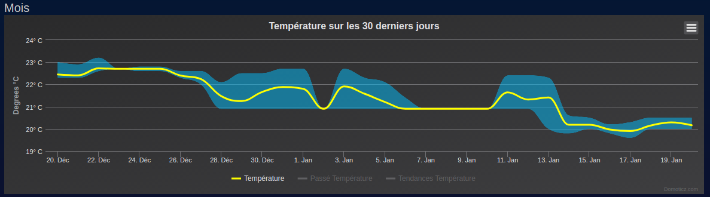

Title: Jouer avec le thermomètre USB Temper v3.1 
Date: 2019-01-20 21:10
Slug: jouer-avec-temper-v3-1
Author: Nicolas Drufin
category: domotique
Summary: Mon ancien thermomètre USB Temper étant tombé en panne, je l'ai remplacé par un plus récent, qui s'est avéré récalcitrant.

## Situation initiale

Mon premier thermomètre USB est un Temper de première génération. Il était consulté directement en ligne de commande via [temper-python](https://github.com/padelt/temper-python) et le script envoyait directement la valeur à Domoticz via l'API web. 

## Elément perturbateur

Depuis quelques mois, le capteur présentait une faiblesse : il n'indiquait plus la température en dessous de 21°C.



Après une recherche rapide sur les tickets des projets github faisant l'interface avec l'appareil, je me rends compte que c'est très probablement un bit qui ne fonctionne plus. Je décide donc d'en racheter un nouveau sur une célèbre plateforme de vente en ligne.

## Péripéties

Le problème, c'est qu'entre temps la version de temper a évolué et depuis la version 2, l'appareil passe maintenant par le bus HID pour communiquer. Impossible donc d'utiliser le code initial qui utilisait libusb pour le temper v1.3.

En suivant les instructions trouvées çà et là sur le web, j'ai commencé par faire un script qui utilisait `hid-query` de [edorfaus/TEMPered](https://github.com/edorfaus/TEMPered) pour envoyer les commandes en hexadécimal directement via `/dev/hidraw` du thermomètre USB. Voici à quoi cela ressemblait :

```
#!/bin/bash
# Temp sensor for Temperv1.3
DEVID=/dev/hidraw5
HIDPATH=./utils/hid-query
OUTLINE=`sudo $HIDPATH $DEVID 0x01 0x80 0x33 0x01 0x00 0x00 0x00 0x00|grep -A1 ^Response|tail -1`
OUTNUM=`echo $OUTLINE|sed -e 's/^[^0-9a-f]*[0-9a-f][0-9a-f] [0-9a-f][0-9a-f] \([0-9a-f][0-9a-f]\) \([0-9a-f][0-9a-f]\) .*$/0x\1\2/'`
printf "%d\n" $OUTNUM | awk '{printf("%4.1f\n",$0/100)}'
```

Cela fonctionnait parfaitement sur un PC, mais quand on passait sur Raspberry Pi, les périphériques HID avait tendance à se déconnecter tout seul dans `/dev`.

## Dénouement 

J'ai donc du encore recourir à du python en passant par le script de [urwen/temper.git](https://github.com/urwen/temper.git) qui utilise le bus HID grâce à **pyserial**. Là encore tout n'a pas été facile, car il a fallut aller chercher dans [un vieux commit non mergé](https://github.com/urwen/temper/pull/4/commits/c6535f3357c1e29481c6d4ec09d2ead2e66d2867) un patch pour la version de mon thermomètre USB et remplacer les `with os.scandir(dirname) as it` par de simples affectations, la version de python (3.5) sur le Raspberry Pi n'ayant pas de méthode `__exit__` pour cette instruction. 

## Situation finale

Une fois tout ça effectué, on se retrouve avec un script qu'on peut facilement lancer en ligne de commande de la façon suivante :

```
$ python3 temper.py --json
[
    {
        "manufacturer": "",
        "product": "",
        "productid": 8455,
        "devnum": 4,
        "firmware": "TEMPerGold_V3.1",
        "hex_firmware": "54454d506572476f6c645f56332e3120",
        "internal temperature": 22.06,
        "devices": [
            "hidraw0",
            "hidraw1"
        ],
        "vendorid": 16701,
        "hex_data": "8080089e4e200000",
        "busnum": 1
    }
]
```

Quelques instabilités subsistent tout de même : régulièrement le message `"error": "Unknown firmware ld_V3.1: b'8080089e4e200000'"` apparait dans la réponse et la température n'est pas retournée. J'ai donc aménagé le script d'envoi des données pour pallier à ce problème mais je n'ai pas de solution concrète, à part peut être un problème d'alimentation insuffisante (qui serait également la cause de la défaillance du périphérique `hidraw` qui n'apparaîtrait pas dans le `/dev`). A suivre donc.